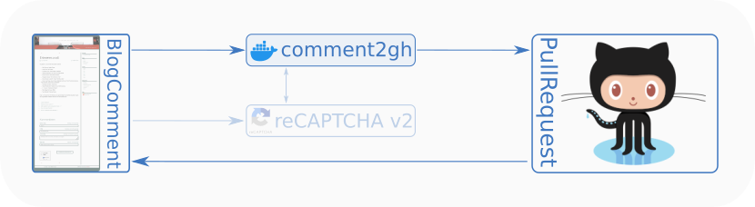

# Comment to GitHub

> Convert blog comments to GitHub PRs

A small service running in a docker container that
* receives blog comments from a HTTP form
* checks them via [Google reCAPTCHA v2](https://developers.google.com/recaptcha/docs/display), when enabled (please observe GDPR compliance!)
* converts them into a format suitable for Jekyll
* posts them as Pull Request on GitHub

This service is the bridge between visitor participation and static hosting.



## Background

The project idea is following a [blog article by Damien Guard](https://damieng.com/blog/2018/05/28/wordpress-to-jekyll-comments/): GitHub's static hosting can still be used in conjunction with dynamic content such as blog comments.

Initially this service was intended to trigger a GitHub workflow. However, there are practical reasons for calling the API directly:
* There is not much difference between calling the API endpoint for a workflow and calling the API endpoints to do the workflow's work directly.
* The GitHub token is needed in any case.
* We are saving on workflow minutes.
* As the data format is fixed, there is also less need for individual configuration of these workflows. If necessary, there can always be a follow-up workflow on PR creation.

However, in the end this is a transformation between an incoming HTTP POST and a series of outgoing HTTP POST calls.
It should be not too hard to convert this into a Lambda Function or a similar on-demand structure.


## Usage

### Run with Docker

With the configuration stored in a file `.env`, the daemon can be started as follows: 

```bash
docker run --rm \
  -p 8080:8080 \
  --env-file .env \
  mrtux/comment2gh
```

### Configuration

Configuration is done using environment variables:

* `GITHUB_USER`: GitHub user who owns the target repository
* `GITHUB_TOKEN`: Access token for the repository
* `GITHUB_REPOSITORY`: The name of the target repository
* `GITHUB_AUTHOR`: Commit author name (default: `comment2gh Bot`)
* `GITHUB_EMAIL`: Commit author e-mail
* `GITHUB_DEFAULT_BRANCH`: Where to start the PR branches (default: `main`)
* `GITHUB_LABEL`: If set this will add a Label to the created PR. This label must exist! (default: None)
* `RECAPTCHA_SECRET`: Secret for [Google reCAPTCHA v2](https://developers.google.com/recaptcha/docs/display) service (disabled when not provided)
* `SERVICE_PORT`: Port for the HTTP Service (default: 8080)
* `CORS_ORIGIN`: Allowed origins for the request (default: `*`)
* `FORM_SLUG`: Field name for the blog entry's slug  (default: `cmt_slug`)
* `FORM_NAME`: Field name for the commenter's name (default: `cmt_name`)
* `FORM_EMAIL`: Field name for the commenter's e-mail address (default: `cmt_email`)
* `FORM_URL`: Field name for the commenter's chosen URL (default: `cmt_url`)
* `FORM_MESSAGE`: Field name for the comment message (default: `cmt_message`)
* `FORM_EMAIL_CHECK`: Configure e-mail checking to one of `required`, `optional` or `none` (default: `optional`)

Please refer to the  [GitHub documentation on Creating a Personal Access Token](https://docs.github.com/en/authentication/keeping-your-account-and-data-secure/creating-a-personal-access-token)
on how to the `GITHUB_TOKEN`.

The `FORM_EMAIL_CHECK` decides how the e-mail field is handled:
* With `required` any request that does not provide an e-mail address will be rejected.
* Use `optional` (default) to allow, but not require an e-mail address.
* Set to `none` to ignore and filter e-mail addresses. This helps with GDPR compliance on sites that use a public repository.


## API

### HTML Form

Please have a look at the [example form](example/example-form.html) on how to embed the service into a static
website. The `{{ ... }}` sections mark where values need to be entered by your backend or templating engine. 
Service and form are tested with [Jekyll](https://jekyllrb.com/).
If you change field names, please also adapt the service configuration accordingly.

Of course, other ways of designing your form  (purely static, jQuery, …) are available.
This service just expects to be fed with `application/x-www-form-urlencoded` data, as a browser would normally send, and looks for the configured form fields.

If successful, the call returns a JSON document like this:
```json
{
  "cid": 682601156,
  "date": "2022-05-05T15:46:01.696174",
  "pr": 25
}
```

Please note that other than the `FORM_MESSAGE` all fields must be single-line and newline characters will lead to an error response.

### Google reCAPTCHA

When the `RECAPTCHA_SECRET` is configured, a verification with [Google reCAPTCHA v2 (Checkbox)](https://developers.google.com/recaptcha/docs/display) will be performed.
The [reCAPTCHA example form](example/example-form-recaptcha.html) shows a client-side example.

Please be aware that this will send data to Google!
Only the minimal amount of data is sent, i.e. excluding the IP address, yet this needs to be mentioned in any GDPR declaration.

To disable this feature, just leave the `RECAPTCHA_SECRET` unset or empty. 


### Health endpoint

The daemon features a health endpoint to check if all components are up and running.
While a certain amount of resilience is built into the handlers, an overall check routine using the Docker
health checks has been established. 
The endpoint works similar to health endpoints expected for Microservices, e.g. in a Kubernetes runtime environment:
* HTTP status 200 is returned when the service is considered healthy.
* HTTP status 500 is returned when the service is considered unhealthy.
* Additional information can be found in the return message. Please refer to the [OAS3](src/OAS3.yml) for details.

The [Dockerfile](Dockerfile) sets the container up for a health check every 10s, otherwise sticks to the Docker defaults.

To expose the health endpoint, route port 8080 to a port that is suitable for the deployment environment. 


## Maintainers

* Stefan Haun ([@penguineer](https://github.com/penguineer))


## Contributing

PRs are welcome!

If possible, please stick to the following guidelines:

* Keep PRs reasonably small and their scope limited to a feature or module within the code.
* If a large change is planned, it is best to open a feature request issue first, then link subsequent PRs to this
  issue, so that the PRs move the code towards the intended feature.


## License

[MIT](LICENSE.txt) © 2022 Stefan Haun and contributors
